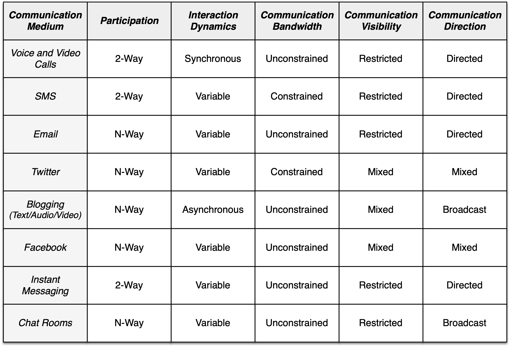

When thinking about social dynamics in online social systems, it is important to consider the attributes of the communication medium that bound the set of permissible interactions. This week I've been revisiting a set of dimensions along which to characterize communication mediums in general. Here is an expanded set based on past musings from several years ago and more recent discussions.  I'm providing a working definition and a set of discrete values for each dimension. This is to aid the categorization process.   

*   **_Participation_** - Number of individuals that can participate in any given communication event. (_2-Way Interaction, N-Way Interaction_).

*   **_Interaction Dynamics_** - Pace of communication interaction between participants. In the past, I've thought of communication mediums as supporting either synchronous or asynchronous communication, where synchronous communication implies real-time interaction. In reality, this dimension is continuous given multiple communication mediums exist that support seamless transitions in the rate of exchange. (_Synchronous, Asynchronous, Variable_)

*   **_Communication Bandwidth_** - Available bandwidth for the communication content. In some communication mediums, we are bandlimited to the point that it forces us to be concise in communicating our message. In other mediums, the available bandwidth is high enough so that no modifications in communication style are required. I've chosen discrete values for this dimension that reflect the impact of the available bandwidth on our behavior. (_Constrained, Unconstrained_)

*   **_Communication Visibility_** - Scope of the audience for a communication event. When discussing visibility, it is common to make the binary distinction between public and private content. What is lost in this dichotomization is the notion that people disclose information to a range of audiences of varying scope. Therefore the definitions of public and private are unclear. It seems more appropriate to focus on whether the medium offers the opportunity for restricted disclosure. (_Restricted, Unrestricted, Mixed_)

*   **_Communication Direction_** - Explicit specification of recipients for a communication event. In some communication mediums, recipients are always required. In others, recipients are never specified. Newer mediums are supporting communication with and without recipient specifications. (_Directed, Broadcast, Mixed_)

With these dimensions defined, let us consider how various communication mediums are related.

Having a taxonomy for communication mediums allows us to construct an overview such as this of the different options in existence today. It also begins to expose some of the interesting distinctions between mediums that are worth further discussion.

As one example, consider the mediums of email and Twitter.  The notable distinctions between these mediums occur along the communication visibility and direction dimensions. As regular email users, we all know that email is private by default and directed to specific recipients defined by the sender. Awareness of the contents of the email can be shared more broadly with the addition of other recipients in the CC or BCC fields. Tweets on the other hand are public by default; yet they also can be directed to specific users by the sender. Such public, directed tweets are similar to emails with a CC to the audience at large.

An interesting distinction emerges here in who has control over the definition of the receiving audience for the CC. In the case of email, control resides with the email sender. Within Twitter, control resides with the other users.  They ultimately decide who to follow and therefore what carbon copies they receive. Empowering the recipient with attentional control is a game changer that I believe is often overlooked and misunderstood.

Please reflect on the above definitions and see if you believe they are sufficient to highlight the significant differences in mediums. This is continual work-in-progress as I reflect on the new mediums we see emerging. Your comments and questions are most welcome.

_Update - In the original table above, I indicated N-way interaction for voice and video calls which was meant to imply two or more participants. This caused some confusion and did not seem to reflect the dominant volume of interactions on those channels. I have since revised the table to show attribute values that reflect the dominant pattern of communication on any given channel. It seems more appropriate as well to adopt the definition that N-way interaction implies three or more individuals are communicating with one another. This allows one to make a clean distinction between pairwise and group interaction._
