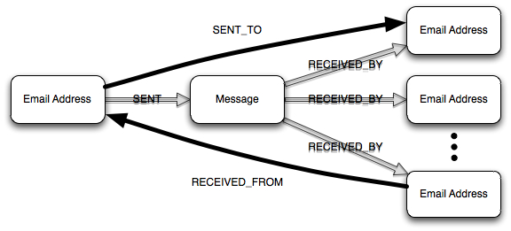

In my first post, I advanced the idea that in order to conduct exploratory data analysis (EDA) we need four basic capabilities: _persistence, query, analysis and visualization_. Moving forward, I want to talk about specific approaches and capabilities I've examined that I believe provide value for EDA. In this post, we'll focus on mechanisms for persistence and query.

If you've paid even the slightest attention to recent advances in the database world, it should be clear that the array of available capabilities is ever increasing. The [NoSQL](http://en.wikipedia.org/wiki/NoSQL) movement is responsible for many of the newest arrivals. I focused on NoSQL databases because of the appeal of a schemaless database. When conducting EDA, we don't yet understand the patterns in the data that are of interest. In addition, we may have an evolving list of questions we wish to ask of the data. Therefore any mechanism that simplifies data representation and conditioning, so that we may cycle faster in our exploration, is a benefit.

One of the first questions I considered when attempting to prune the space of candidates is: should I use a graph database? This immediately led to another question: how is a graph database distinct from other databases? Some have advanced the [definition](http://www.slideshare.net/slidarko/graph-databases-trends-in-the-web-of-data) that "a graph database is any storage system that provides index-free adjacency." Stated more simply, a graph database is a storage system that captures an explicit representation of a graph. With index-free adjacency, one-hop traversals in the graph become constant time operations, giving graph databases the edge when deep traversals of the graph are required.

When first considering the question of whether or not to use a graph database, I viewed the question from an either/or perspective where the goal was to choose one database. Later on, it became clear that this was a limited way to think about the problem. Different classes of databases have their use cases at which they excel. It is possible that no one class of database will provide all the capabilities required. When working with social media data that presents both rich structured and unstructured data, [polyglot persistence](http://www.slideshare.net/jwoodslideshare/polyglot-persistence-two-great-tastes-that-taste-great-together-4625004) seems more appropriate. This allows one to use a graph database to capture the multi-relational graph structure while another database represents the unstructured attribute data.

Having decided to use a graph database to represent aspects of my data, I turned my attention toward graph query languages to understand how this further constrained the viable database options. It is during this search that I discovered the graph traversal language called [Gremlin](https://github.com/tinkerpop/gremlin/wiki/) developed by [Marko Rodriguez](http://markorodriguez.com/). [Marko and several others](http://www.tinkerpop.com/) have been hard at work since November 2009 developing a graph processing stack that allows one to persist and process general [property graphs](https://github.com/tinkerpop/gremlin/wiki/Defining-a-Property-Graph) using one of several available graph databases. Currently the stack supports [Neo4j](http://neo4j.org/), OrientDB, RDF Sail and an in-memory graph database called TinkerGraph. Support for [Redis](http://redis.io/), [InfiniteGraph](http://www.infinitegraph.com/) and [DEX](http://www.sparsity-technologies.com/dex.php) is planned for future releases.

While perusing the [Gremlin documentation](https://github.com/tinkerpop/gremlin/wiki/) and Marko's [presentations](http://www.slideshare.net/slidarko), it became clear that Gremlin has the potential to provide significant utility for EDA by simplifying the implementation of complex [graph rewriting](http://en.wikipedia.org/wiki/Graph_rewriting) operations. This is significant because of the core data representation challenge I alluded to earlier. During EDA, we are not yet aware of the underlying patterns in the data. Therefore we do not understand what representations are most appropriate. To reduce the time required to uncover those patterns, we want to take advantage of any techniques that allow us to quickly investigate different perspectives on the data.

Graph rewriting involves the transformation of one graph to another through some set of operations. If we have a mechanism to efficiently implement and execute graph rewriting operations, we can develop a base representation for the data, the _data graph,_ and apply graph rewriting operations as needed to the data graph to filter and transform the data for other analyses.  

One of the core concepts brought to bear when defining graph rewriting operations in Gremlin is the _[user-defined step](https://github.com/tinkerpop/gremlin/wiki/User-Defined-Steps)_.  A user-defined step is a sequence of one or more atomic steps in a multi-relational graph. Through the use of user-defined steps, we are defining new definitions of adjacency and higher-level abstractions to utilize when operating on the data graph.

My first application of user-defined steps was in the definition of a graph rewriting operation that would take a portion of the Enron email data graph and construct the 1.5-hop communication graph for a specified email address. Consider the diagram below.

In the data graph, a given email message is represented by a collection of email address and message vertices. SENT and RECEIVED_BY edges specify the relationships between those addresses and the message. The communication graph represents the volume of communication between email addresses with weighted, directed edges. By defining the SENT_TO and RECEIVED_FROM steps, we can more easily express attributes of the data graph that are relevant to the construction of the communication graph.

This is a trivial example relative to the range of possibilities that Gremlin enables. Many more complex operations can be easily expressed with [Gremlin's syntax](https://github.com/tinkerpop/gremlin/wiki/Gremlin-Steps). The [recent screencast](https://www.youtube.com/watch?v=5wpTtEBK4-E) Marko did on Gremlin provides a better sense of its capabilities through a series of examples.

Gremlin has recently migrated to Groovy as its host language. The opportunities available now are huge. I'm looking forward to exploring the art of the possible with Groovy Gremlin in the future and sharing more results here. As we begin to discuss complete technology stacks that support EDA, I'll share more thoughts, and hopefully more examples, on ways the composition of Gremlin with other capabilities provides utility. At the moment, I'm only limited by my lack of Groovy skills, not a lack of ideas to explore.

[[Part 1 of the series]()]