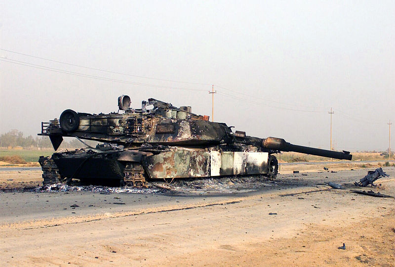
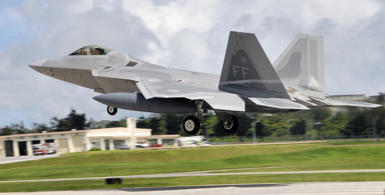
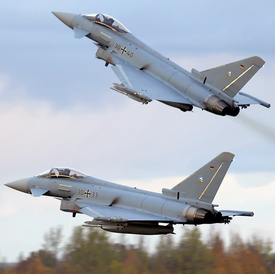

This year, I've had the opportunity to speak on several occasions with members of the national security community about organizational resilience in an uncertain world. These presentations have mainly been a continuation of musings that I began last year, leading me to write these two [earlier]() [posts]() on the subject. During these presentations, my aim has always been twofold: to make the audience more cognizant of the limits we face when attempting to reason about our world and to provide a general frame for thinking about operating in an environment that is fundamentally unpredictable.

Within the national security community, many are required to reason about the future of complex phenomena in our world. Far too often, they are forced to make predictions about future outcomes that are unpredictable. The need to make such predictions often stems from a slow response cycle. Therefore risk is compounded by the implications of an incorrect prediction coupled with an inability to rapidly respond to emergent realities.

Nowhere is this risk more obvious than in the Department of Defense's (DoD) acquisition system. In major acquisition programs, it is not uncommon to see program life run 10-20 years from initial requirements definition to full scale production. Therefore the DoD is required to speculate about the future threat environment many years into the future. Enormously expensive programs become conditioned on a set of hypotheses that won't be fully tested for years to come.

One of the clearest examples of a flawed prediction came in the US Army's [Future Combat Systems](http://en.wikipedia.org/wiki/Future_Combat_Systems) (FCS) program. Starting in the early 2000s, there was only one program within the Army: FCS. FCS represented the future of how the Army would fight. One of the core tenets of FCS was that there existed a tradeoff between information superiority and armor requirements that could be exploited. With the presence of organic intelligence, surveillance and reconnaissance (ISR) assets in the FCS brigade combat team, it was believed that 60-ton armored vehicles could be replaced with 20-ton armored vehicles. These ISR assets would provide the necessary information superiority to mitigate the risk of increased vulnerability.

What happened following our initial decisive victory in Iraq in 2003? The asymmetric threat emerged in the form of the improvised explosive device (IED). In classic form, the US scrambled to find a technological solution to this problem to improve our ability to detect the threat. Unfortunately that proved to be no easy task. IEDs were cobbled together with whatever resources were available. In addition, employment tactics were constantly evolving. We were faced with a tenacious adversary that was constantly probing and experimenting. Any detectable and exploitable regularities could be lost in short order. We were not learning nearly as fast as our adversary.

The implication of this vulnerability was clear. Our lack of situational awareness meant 20-ton vehicles were severely threatened. Later on, even 60-ton [M-1 Abrams](https://en.wikipedia.org/wiki/M1_Abrams) main battle tanks were being compromised by powerful new IEDs. With their destruction lay the wreckage of the FCS hypothesis.

More recently, another potentially threatened hypothesis surfaced in the press. Earlier this year, German [Eurofighter Typhoons](https://en.wikipedia.org/wiki/Eurofighter_Typhoon) [caused a bit of a stir](http://theaviationist.com/2012/07/13/fia12-typhoon-raptor/#.UL2BtZPjk8Y) during an air-to-air combat exercise when facing off against US Air Force [F-22 Raptors](https://en.wikipedia.org/wiki/Lockheed_Martin_F-22_Raptor). The Typhoons reportedly were able to get within visual range of the Raptors and defeat some of them. The Raptor by design is meant to detect and engage threats beyond visual range (BVR), capitalizing on stealth, advanced sensors and weapons to strike first without warning. Thesrefore initial reporting of the Typhoons getting in close and killing the Raptor raised a lot of questions. Some contend that the Red Flag engagements were contrived to stress the limits of the Raptors and therefore provide no new insights into the relative performance of the Raptor. This seems consistent with the Germans' comments about the Raptor's overwhelming capability BVR. Others suggest a simple disagreement on outcomes.

While the Raptor advantage may not be currently threatened, the point is that 'silver bullet' technologies can quickly become obsolete with unforeseen advances in technology and tactics, negating enormous investments to bring them to fruition. The ability to adapt quickly to shifts in the environment is key to avoid severe downside risk associated with flawed predictions.

In discussions following my presentations, the reactions from members of the audience were quite illuminating. Some audience members were clearly in denial about the limits we face. When pressed with further examples, continued resistance ensued. For others, the message clearly penetrated but uneasiness followed. Strategic planning lies at the core of many government organizations. Calling such a central operating principle into question left some wondering how to proceed. Others clearly called out the weaknesses in the acquisition system and felt saddled with a reality that left them few options.

Discussions like these hopefully seed the landscape for further reflection and reform. Thankfully others are [championing the need for a shift in perspective](CNAS_Prediction_Danzig.pdf). I'm concerned about the lack of awareness of our limitations that results in government programs seeking magical technological solutions to remove the ambiguity that lingers on the road ahead. More often, we need to turn our gaze inward to reflect on our own processes to understand how they aid or hinder our performance when wicked challenges arise.
