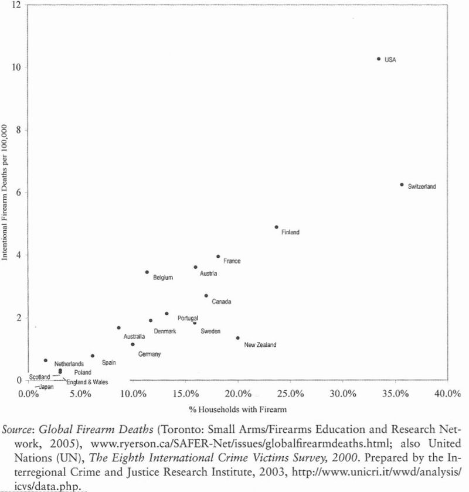

Senseless tragedies such as the recent Sandy Hook school shooting in Newtown, Connecticut give us pause as a nation and leave us struggling to understand how these acts happen all too often. With each loss, I begin to wonder if we are learning as a society. Are we truly reflecting on the problem or are we trapped in the same patterns that prevent us from moving forward? A closer look at how we respond hints at an answer.

In the early hours after the shooting, the emotional impact on the nation felt severe. My Facebook and Twitter feeds were consumed with sadness and dismay as we attempted to understand the details of the situation. Once the narrative became clearer, it ignited feelings that were hard to ignore. Such cognitive priming is a powerful force. One whose effect I believe we often underestimate.

Within short order, the calls for action began. The national conversation pivoted to gun control with such blistering speed and intensity that many sensed a moment for change. We fixated quickly on the implement of the devastation, the assault weapon, a prominent aspect of the event that is easiest to comprehend. Focusing on the obvious and the available gives us a place to start. When attempting to find answers and take action, we are not prepared to take on the subtle and less visible forces at play. Where do we even begin on those fronts? The impact of guns on society should be easier to understand and discuss, right?

Well maybe not.

I started searching online for open data to understand the relationship between the availability of guns and gun deaths. My search reminded me of the difficulty of finding specific open data to address a particular question. We are awash in data sources these days; yet they are scattered and varied in terms of their utility.

During my search, I stumbled upon the following figure depicting intentional firearm deaths per 100,000 people versus the percentage of households with a firearm. It showed the relationship I was looking for and confirmed what I suspected. I posted this to Facebook and got mostly comments wondering why the US is such an outlier. One friend went down another path: questioning the conclusions to be drawn from the figure itself. He wanted to know how many innocent civilians were killed versus criminals and how many lives were saved by a citizen having a gun during a crime. I knew where this was going. The common refrain from the pro-gun lobby is that society stands to benefit from citizens having weapons to deal with these situations when they unfold. Therefore his natural response was to question while mine was to accept; we each remained consistent with our prior beliefs.

Later on I started to reflect on whether my faith in the result was justified. Where did this data come from? Who put this figure together? What are their beliefs, intentions and motivations? Is my friend's skepticism warranted?

After several days of reading numerous news articles from my preferred sources, with facts and figures galore, I was tired. I could not digest any more. I disconnected for a bit and gave myself space to reflect. During this time, another question came to mind: with instant access to global dialogue, reporting and open data, am I afforded more opportunity to better understand complex issues today over years past? I'm not convinced we've made a significant improvement. In fact, one might argue the situation is worse.

Much of the content I consumed merely reinforced my prior beliefs in those early days. Some of the national dialogue I listened to began to ask the deeper questions but with little reflection on answers. Wicked social challenges are wicked precisely because of their complexity, where nonlinearity, interdependency and uncertainty weave together to create systems defying simple explanation. In the face of this wicked social challenge, I ultimately realized I only knew one thing with certainty: an assault weapon with a high-capacity clip in the hands of a skilled individual can quickly rain devastation down on others.

While some open data advocates speak of a brighter future enabled by greater perspective on our world, I cannot help but fixate on timeless constraints such as incentive structures and cognitive biases. When data does not threaten a particular position or worldview, the underlying reality portrayed by a data source stands a greater chance of being broadly accepted and potentially influential. When data threatens a position or is presented by a party with a particular agenda, questions will surface. Others with counter with data of their own. How does open data somehow mitigate questions about provenance and legitimacy? Does it stand to enable greater impact on public discourse? On issues where the stakes are perceived to be high, I'm skeptical.

The pattern of self-deception in a complex environment seems routine these days. Many are unaware or, in some cases, unwilling to admit that there are fundamental limits to what is knowable about our world. Meanwhile the desire for plausible, causal narratives remains. Without conscious effort, we are predisposed to extrapolate from the few and the available while seeking coherence. In today's media environment, coherence is easier than ever to design given the plethora of voices one can choose from. This leaves cause for concern.

Given the impact of cognitive biases and self-interest, along with fundamental limitations on what we can understand, I wonder about the best ways to approach public policy challenges. At the end of the day, decisions must be made, resources allocated and actions taken. How do we design measurement approaches that allow us to learn in some manner that is robust to these confounding factors? It seems we're still wanting for answers.
