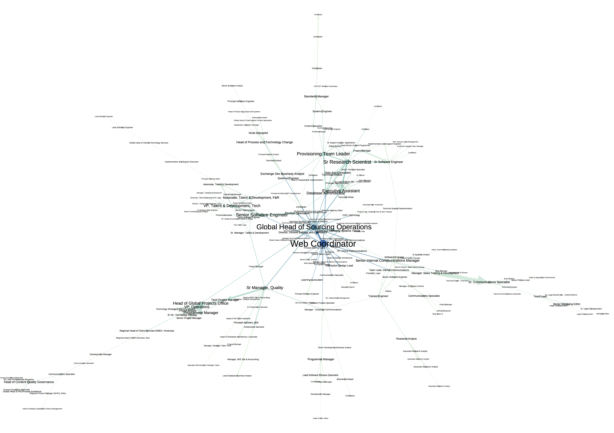

**Filtering the Global Interaction Graph**

In my [previous post](), we discussed the core problem of identifying groups of users engaged in substantive collaboration and began to formulate a solution based on interaction graph analysis. At the end of the post, we examined the first global interaction graph I rendered for a large multinational corporation. While it was exciting to see this global view for the first time, the global interaction graph provides negligible practical insight without additional processing.

To tease the interaction graph apart, I performed a sequence of two filtering steps: _k-core filtering_ followed by _edge weight filtering_. The _k_-core of an undirected graph is the subgraph containing every node that is connected to at least _k_ other nodes. In more practical terms, the _k_-core represents all users that have interacted with at least _k_ other users. _K_-core filtering of the corresponding symmetrized interaction graph helps us focus in on denser regions of the interaction graph.

When performing _k_-core filtering in order to search for group collaboration, one must be mindful of the implications associated with the choice of _k_. If the minimum sized group one is interested in detecting contains _n+1_ users, _k_ must be no larger than _n_. For a group of _n+1_ users, full direct connectivity among the members implies each user is connected to _n_ other users. Therefore, in practical terms, _k_ will often need to be smaller than _n_ to detect dense groups without full direct connectivity.

After reducing the interaction graph to a specified _k_-core, additional edges are removed from the core by removing directed edges with counts below a minimal edge count _m_. For interaction graphs that aggregate interaction events over a period of _d_ days, the edge count thresholding removes interaction relationships with rates of interaction below _m_/_d_.

Applying these filtering steps to the global interaction graph removes extraneous structure and shatters the graph into the core and a series of much smaller peripheral subgraphs. For the ongoing discussion, we will focus on the filtered 5-core depicted below. Node size and color in the core are proportional to the total number of interaction relationships for each user. The node labels specify user job titles. Edge width is proportional to the interaction count for each relationship. For deeper investigation of the filtered 5-core, please visit this [interactive view](http://zoomhub.net/NcY8) of the graph.

**The Importance of Representation**

Once the global interaction graph is filtered, a number of structural features become prominent: central users, highly active relationships, long pathways and user clusters. While the user and relationship features are straightforward to interpret, the significance of the long pathways and user clusters is less clear. The reason for this stems from the definition of the global interaction graph. Recall that the global interaction graph represents an aggregation of the underlying complex event data along multiple dimensions. Events are aggregated not only over time but also over interaction type and location within the Jive platform. Aggregation of interaction events across locations is an aggregation over varying social contexts. In some cases, two users may be interacting in a secret social group where discussion about a sensitive initiative is limited to a select few. In other cases, their interaction may be in a social group where discussion is open to any interested user.

Conflating interaction across social contexts complicates the search for groups of users involved in substantive collaboration. If our desire is to ultimately discover emerging use cases, we want to uncover user clusters that are embedded in a given social context. When users are working together to support a particular project or organizational mission, we expect aspects of the work to reside in one location devoted to that objective. Therefore we require the capability to localize user clusters in particular locations. Starting with a graph representation that aggregates across all possible locations prevents us from uncovering the natural clustering that unfolds in particular social contexts.

As we progress in our analysis of a particular phenomenon, it is important to remain mindful of our representational choices and the ways in which they impact our conclusions. At first, those implications may not be obvious, especially when we are wrestling with complex data. Therefore revisions will likely be required as we appreciate the nuance along the path to our ultimate analytic objective. In the [final post](), we'll separate the global interaction graph by location and address the problem of structural cueing to aid us in uncovering localized user clusters.
