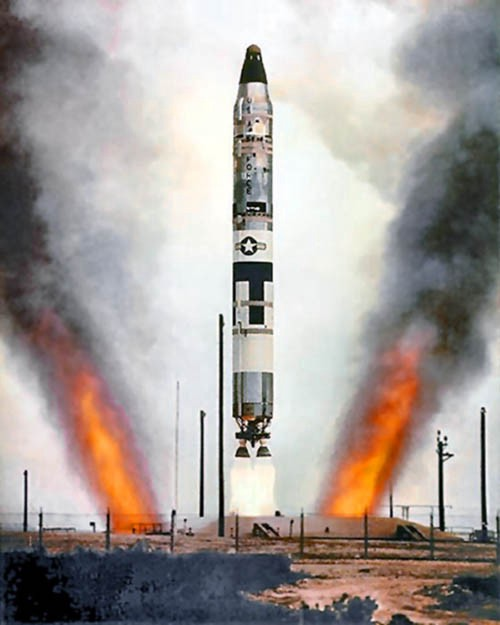
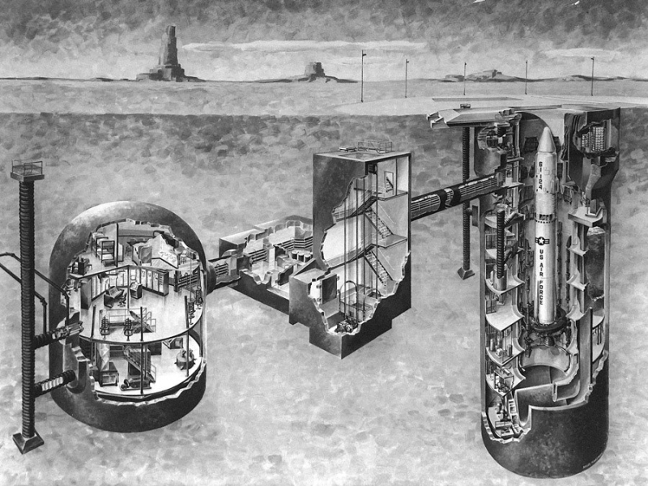
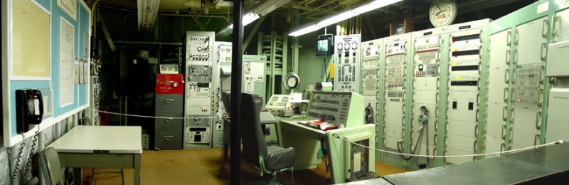
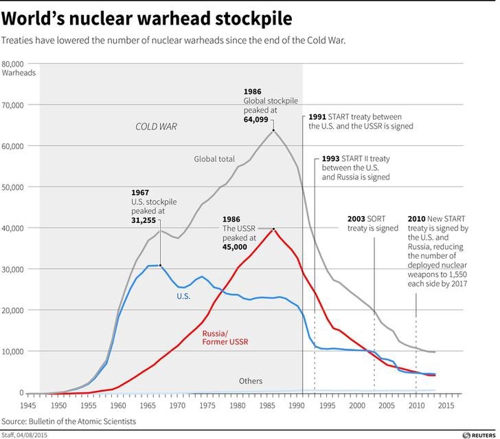

Late last year, I was driving south out of Tucson, Arizona to see a relic of the Cold War. Hidden in the stretches of the Sonoran desert is a small facility housing one of the most destructive creations of the US nuclear weapons program — the Titan II intercontinental ballistic missile (ICBM).

	Titan II test launch in the 1960s (Source: US Air Force)

The Titan II is an imposing weapon system, standing 103 feet tall and 10 feet in diameter. When operational, the Titan II carried the largest warhead of any US ICBM with a yield of 9 megatons, making it over 400 times more powerful than the Fat Man nuclear device detonated over Nagasaki in 1945\. With such destructive force, a single Titan II could wipe out the entire L.A. metro area.

Figures such as these are overwhelming to process. Logically I can comprehend the facts, and yet emotionally, I’m left simultaneously mystified and horrified. How did we come to a point in human history where these technological creations were deemed necessary and appropriate? I hoped visiting the missile silo might provide some perspective.

* * *

Driving up to the site, it’s clear it would be nearly impossible to discover from ground level without guidance. The small fenced facility is unremarkable in many respects except for the antennas around the site — particularly those around the silo doors that provided warning of approaching intruders.

  Artist rendering of a Titan II missile complex (Source: Titan Missile Museum)

Hidden underground is a vast complex that was dedicated to keeping the Titan II ready for launch at a moment’s notice. At any point in time, a combat crew of two officers and two enlisted personnel would be on alert for a 24 hour period.

	Launch control center (Source: Titan Missile Museum)

While standing in the control room, our tour guide covered the [sequence of events](http://titan2icbm.org/lnch.PDF) leading up to the launch of the missile. Broadly speaking, that sequence involved the receipt of a launch order, confirmation of the order, and commencement of the process to fire the weapon.

My thoughts focused on the crew members in that final phase of the sequence, when the keys are turned and final preparations are made for launch. What would go through their minds when a legitimate order came through, knowing their actions would lead to the deaths of millions? I was surprised at first to learn that the crew would be unaware of the target for the missile. And yet with some reflection, that ambiguity seemed crucial to carry out the plan.

* * *

Moving from the control room down a long hallway, our tour group arrived inside the silo where the full-scale Titan II missile trainer stands today. We peered through the small windows to take in the enormity of the missile. Meanwhile, our tour guide shared the story of a [major accident](http://www.pbs.org/wgbh/americanexperience/features/command-and-control-chapter-1/) that occurred on September 18, 1980 at a Titan II missile silo near Damascus, Arkansas.

During that unfortunate event, a massive socket was dropped while two crew members were servicing the missile. The socket fell to the bottom of the silo and struck the side of the missile, puncturing the skin and causing a significant leak of volatile liquid fuel. Hours later, the missile exploded, catapulting the nuclear warhead out of the silo without detonation. In the intervening time, tensions ran high as officials wrestled with the possibility of warhead detonation and the devastation that would befall nearby Little Rock.

For many years, the US military claimed that such accidents were rare and proper procedures were in place to mitigate the risk of cataclysmic events. The reality, uncovered much later through a [declassified document](http://www.pbs.org/wgbh/americanexperience/features/command-and-control-broken-arrows-how-many-nuclear-accidents-have-we-had/), was otherwise. Nuclear weapons accidents were happening at rates far higher than official admissions indicated.

* * *

Walking out of the silo, I contemplated the collective creative energy that was devoted to the development of this technological artifact with such horrific potential. The scientific and engineering accomplishments manifest in this weapon system are truly incredible. And yet, I couldn’t help but contemplate what alternative futures could have emerged if that creative energy was invested in more positive endeavors.

Consider the macro view of the investment over the course of the Cold War.

At the peak of the Cold War, the global stockpile consisted of over 64,000 nuclear weapons. Let that sink in for a moment. That magnitude of destructive firepower is enough to devastate the world numerous times over. Thankfully since the peak, we have made significant strides in reducing the global stockpile. Unfortunately the thousands of nuclear weapons that remain on alert can still end life as we know it.

What lessons can we draw from this period? Lessons that we must remind ourselves of as nuclear tensions are on the rise. Looking at the magnitude of weapons produced, I can contemplate no rational argument in defense of that outcome. What I see instead in this chart is a timeline of the magnitude of fear and uncertainty in the collective subconscious of leadership within the US and former Soviet Union. With a refusal to confront our own fears and those of our adversary, we ended up in an inconceivable position.

At present, my mind is drawn to questions about our nuclear narratives. What stories were we telling ourselves then to justify our actions? What stories linger today that are guiding our choices about our nuclear future?

* * *

Later this year, the Department of Defense will complete the ongoing Nuclear Posture Review (NPR), providing updated guidance on the role of nuclear weapons in the defense of the nation. The NPR is occurring against the backdrop of increasing Russian aggression meant to reestablish Russia as a global power. This includes reports of the [possible deployment](https://www.washingtonpost.com/news/checkpoint/wp/2017/02/15/this-is-the-ground-launched-cruise-missile-that-russia-has-reportedly-just-deployed/) of an intermediate-range cruise missile in violation of the [Intermediate-Range Nuclear Forces Treaty](https://en.wikipedia.org/wiki/Intermediate-Range_Nuclear_Forces_Treaty). In response, the Trump administration is signaling a need to accelerate the planned modernization program for the US nuclear triad, projected to exceed $1 trillion dollars in cost over 30 years.

With the emergence of unprecedented grassroots political energy following the election of Donald Trump, I’m curious how we leverage this engagement to make progress in nuclear risk reduction. Generational struggles around issues such as climate change and nuclear disarmament stand in stark contrast to more tactical engagements around specific initiatives the Congress or Trump Administration is advancing. How can the public even engage in the conversations deemed too complex for anyone outside the community of experts? Often we are denied the opportunity to even question the logic of decisions made because they are esoteric and largely out of view.

My sense is the path to progress is on the moral dimension. The public can readily and should rightly question the moral basis for maintaining such a costly and risky class of weapons. Weapons that are intended to deter conflict and yet never be used.

Those involved in the ongoing international effort to ban nuclear weapons through a U.N. declaration make clear that such action is long overdue. Corresponding bans for [biological](https://en.wikipedia.org/wiki/Biological_Weapons_Convention) and [chemical](https://en.wikipedia.org/wiki/Chemical_Weapons_Convention) weapons have been in place for decades. To not acknowledge the corresponding burden posed by nuclear weapons is a level of denial we can no longer afford.

Once a ban is in place, the difficult task of moving to zero remains. How do we decompose that long road into smaller campaigns with defensible and measurable outcomes? I believe part of the solution is to understand how a collective can better track and respond to appropriations decisions made in Congress.

The enormity of responsibly allocating trillions of dollars in the national interest demands collective, collaborative action. As a technologist, I naturally imagine platforms that aid a collective in surfacing issues of concern and directing collective attention to respond. How this can be accomplished in a mainly decentralized and emergent manner is an enormous question. Now more than ever, the need for such innovation feels critical as the resilience of our democracy is tested in unprecedented ways.

